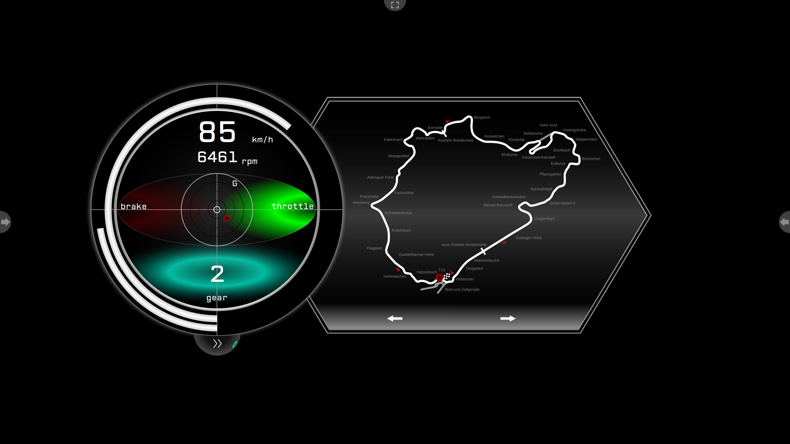
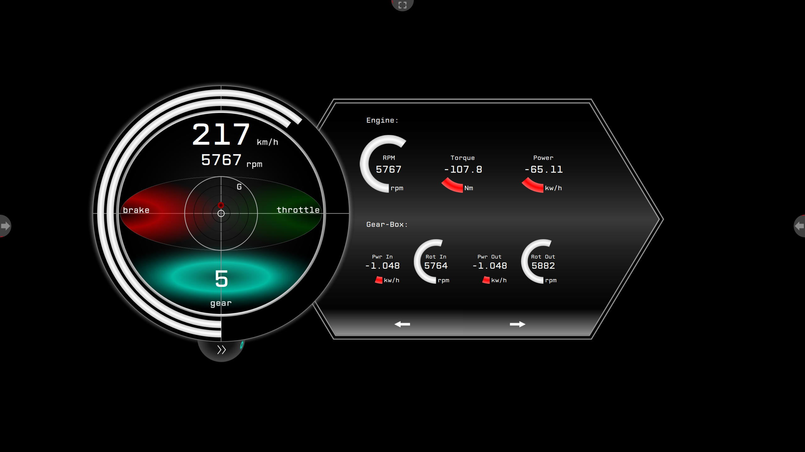

# OpenDashboardFrontend-Template

## Description

TODO

## Usage

	# Clone repo
	git  clone git@github.com:OpenDashboardUI/OpenDashboardFrontend-Template.git
	git submodule init
	git submodule update

	# Building (creating temporary graphic files)
	mkdir build/
	cd build/
	cmake ../
	make

	# Running
	cd ../
	open_dashboard_backend ./Template.xml

## Video

## Preview

 

